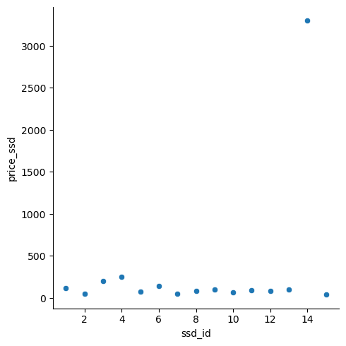

Python_MySQL_Demo
================
Connor Burton
2022-06-24

# MySQL Demonstration in Python

In this brief markdown project, I use MySQL.Connector and a home MySQL
database to create and manipulate a fake relational database of computer
parts, customers, and part orders. Computer parts were copied from
pcpartpicker.com and names were created from a random generator. The
database design is my own creation and is unrelated to any real-world
similarities such as shared names.

### Importing Libs

``` python
#importing modules
import mysql.connector
from mysql.connector import Error
import pandas as pd
import seaborn as sns
import matplotlib.pyplot as plt
import numpy as np
```

### Defining Query Functions and Connecting:

Here I write python functions to create and interact with the MySQL
server that I have set up in MySQL Workbench.

``` python
#writing a connection function for a local SQL db
def create_server_connection(host_name, user_name, user_password):
  connection = None
  try:
    connection = mysql.connector.connect(
      host = host_name,
      user = user_name,
      passwd = user_password
      )
    print("MySQL Database connection successful")
  except Error as err:
    print(f"Error: '{err}'")
  return connection

#connecting using stored password
connection = create_server_connection("localhost", "connor", pw)

#defining a function for DB creation in the MySQL server
```

    ## MySQL Database connection successful

``` python
def create_database(connection, query):
    cursor = connection.cursor()
    try:
        cursor.execute(query)
        print("Database created successfully")
    except Error as err:
        print(f"Error: '{err}'")


#creating DB "orders"
create_database_query = "CREATE DATABASE orders"
create_database(connection, create_database_query)


#defining a function for connecting to the "orders" DB
```

    ## Database created successfully

``` python
def create_db_connection(host_name, user_name, user_password, db_name):
    connection = None
    try:
        connection = mysql.connector.connect(
            host=host_name,
            user=user_name,
            passwd=user_password,
            database=db_name
        )
        print("MySQL Database connection successful")
    except Error as err:
        print(f"Error: '{err}'")
    return connection


#defining a function for DB querying
def execute_query(connection, query):
    cursor = connection.cursor()
    try:
        cursor.execute(query)
        connection.commit()
        print("Query successful")
    except Error as err:
        print(f"Error: '{err}'")
        
```

### Defining and Creating Tables:

This section creates tables based on fields observed on pcpartpicker.com
and a fictional set of fields for the orders and customers tables.

``` python
#defining cpu table-creation query
create_cpu_tbl = """
CREATE TABLE cpu (
  cpu_id INT PRIMARY KEY,
  name VARCHAR(30) NOT NULL,
  cores INT,
  performance_ghz FLOAT,
  boosted_ghz  FLOAT,
  thermal_design_power_w INT, 
  integrated_graphics VARCHAR(20),  
  surface_mount_tech VARCHAR (4),
  price FLOAT
  );
"""

#defining ssd table-creation query
create_ssd_tbl = """
CREATE TABLE ssd (
  ssd_id INT PRIMARY KEY,
  name VARCHAR(40) NOT NULL,
  capacity_gb INT,
  price_per_gb FLOAT,
  type  VARCHAR(8),
  cache_mb INT, 
  form_factor VARCHAR(20),  
  interface VARCHAR (20),
  price FLOAT
  );
"""

#defining customer table-creation query

create_customer_tbl = """
CREATE TABLE customer (
  cust_id INT PRIMARY KEY,
  cust_name VARCHAR(40),
  age INT
);
"""

#defining orders table-creation query
create_order_tbl = """
CREATE TABLE orders (
  order_id INT PRIMARY KEY,
  ssd INT,
  cpu INT,
  cust_id INT
);
"""

####Executing queries
connection2 = create_db_connection("localhost", "connor", pw, "orders")

##cpu table
```

    ## MySQL Database connection successful

``` python
execute_query(connection2, create_cpu_tbl) 

##ssd table
```

    ## Query successful

``` python
execute_query(connection2, create_ssd_tbl) 

##customer table
```

    ## Query successful

``` python
execute_query(connection2, create_customer_tbl) 

##order table
```

    ## Query successful

``` python
execute_query(connection2, create_order_tbl)
```

    ## Query successful

\###Defining Connections in the Relational DataBase (RDB):

This section creates the relations between each table in the MySQL
database. These relations are crudely defined here:

. .


. .

``` python
####defining relations 
#connecting ssd to orders
alter_orders_ssd = """
ALTER TABLE orders
ADD FOREIGN KEY(ssd)
REFERENCES ssd(ssd_id)
ON DELETE SET NULL;
"""
#connecting cpu to orders
alter_orders_cpu = """
ALTER TABLE orders
ADD FOREIGN KEY(cpu)
REFERENCES cpu(cpu_id)
ON DELETE SET NULL;
"""

alter_orders_cust = """
ALTER TABLE orders
ADD FOREIGN KEY(cust_id)
REFERENCES customer(cust_id)
ON DELETE SET NULL;
"""

###executing queries for relating tables
execute_query(connection2, alter_orders_ssd)
```

    ## Query successful

``` python
execute_query(connection2, alter_orders_cpu)
```

    ## Query successful

``` python
execute_query(connection2, alter_orders_cust)
```

    ## Query successful

### Table Population:

This section uses object definitions in python to store values in the
previously-defined tables. Computer parts records represent the first 15
observations on the CPU and SSD product pages on pcpartpicker.com, while
the imagined data was created using a random number generator.

``` python
#populating ssd table
pop_ssd = """
INSERT INTO ssd VALUES
(1,  'Samsung 970 Evo Plus1', 1000, 0.114, 'SSD', 1024, 'M.2-2280', 'M.2 (M)', 114.46),
(2, 'Seagate Barracuda Compute', 2000, 0.025, '7200RPM', 256, '3.5',    'SATA 6.0 Gb/s', 49.99), 
(3, 'Samsung 970 Evo Plus2', 2000, 0.100, 'SSD', 1024, 'M.2-2280', 'M.2 (M)', 199.99),
(4, 'Samsung 980 Pro2', 2000, 0.127, 'SSD', 2048, 'M.2-2280', 'M.2 (M)', 254.99),
(5, 'Samsung 970 Evo Plus5', 500, 0.152, 'SSD', 512, 'M.2-2280', 'M.2 (M)', 75.98),
(6, 'Samsung 980 Pro1', 1000, 0.146, 'SSD', 1024, 'M.2-2280', 'M.2 (M)', 146.24),
(7, 'Western Digital Blue SN550', 500, 0.100, 'SSD', NULL, 'M.2-2280', 'M.2 (M)', 49.99),
(8, 'Western Digital Blue SN550', 1000, 0.081, 'SSD', NULL, 'M.2-2280', 'M.2 (M)', 81.00),
(9, 'Samsung 870 Evo', 1000, 0.104, 'SSD', 1024, '2.5', 'SATA 6.0 Gb/s', 103.57),
(10, 'Seagate Barracuda Compute', 4000, 0.017, '5400RPM', 256, '3.5',   'SATA 6.0 Gb/s', 67.98),
(11, 'Western Digital Blue SN570', 1000, 0.089, 'SSD', NULL, 'M.2-2280', 'M.2 (M)', 88.85),
(12, 'Crucial P2', 1000, 0.085, 'SSD', NULL, 'M.2-2280', 'M.2 (M)', 84.99),
(13, 'Samsung 980', 1000, 0.100, 'SSD', NULL, 'M.2-2280', 'M.2 (M)', 99.99),
(14, 'TEAMGROUP QX', 15000, 0.216, 'SSD', NULL, '2.5',  'SATA 6.0 Gb/s', 3299.99),
(15, 'Western Digital Caviar Blue', 1000, 0.040, '7200RPM', 64, '3.5','SATA 6.0 Gb/s', 40.47);
"""

#populating cpu table
pop_cpu = """
INSERT INTO cpu VALUES
(1,  'AMD Ryzen 5 5600X', 6, 3.7, 4.6, 65, 'None', 'Yes', 198.88),
(2, 'AMD Ryzen 7 5800X', 8, 3.8, 4.7, 105, 'None',  'Yes', 306.00), 
(3, 'Intel Core i7-12700K', 12, 3.6, 5, 125, 'UHD Graphics 770', 'Yes', 379.99),
(4, 'AMD Ryzen 9 5900X', 12, 3.7, 4.8, 105, 'None', 'Yes', 395.98),
(5, 'Intel Core i5-12600K', 10, 3.7, 4.9, 125, 'UHD Graphics 770', 'Yes', 274.99),
(6, 'Intel Core i5-12400F', 6, 2.5, 4.4, 65, 'None', 'Yes', 160.00),
(7, 'AMD Ryzen 5 5600G', 6, 3.9, 4.4, 65, 'Radeon Vega 7', 'Yes', 164.05),
(8, 'Intel Core i9-12900K', 16, 3.2, 5.2, 125, 'UHD Graphics 770', 'Yes', 574.99),
(9, 'AMD Ryzen 5 3600', 6, 4.2, 4.2, 65, 'None',    'Yes', 184.99),
(10, 'AMD Ryzen 9 5950X', 16, 3.4, 4.9, 105, 'None',    'Yes', 537.19),
(11, 'AMD Ryzen 5 5600', 6, 3.5, 4.4, 65, 'None', 'Yes', 179.99),
(12, 'Intel Core i3-12100F', 4, 3.3, 4.3, 58, 'None', 'Yes', 106.99),
(13, 'Intel Core i5-10400F', 6, 2.9, 4.3, 65, 'None', 'Yes', 119.98),
(14, 'Intel Core i5-12600KF', 10, 3.7, 4.9, 125, 'None',    'Yes', 241.00),
(15, 'AMD Ryzen 7 5700X', 8, 3.4, 4.6, 65, 'None','Yes', 286.98);
"""

#populating customer table
pop_customer = """
INSERT INTO customer VALUES
  (1, 'Elizabeth Brown', 53),
  (2, 'Terry Baird', 21),
  (3, 'Thomas Shaw', 13),
  (4, 'Teresa Molina', 42),
  (5, 'John Miranda', 44),
  (6, 'Timothy Hernandez', 26),
  (7, 'Tracy Bushn', 60),
  (8, 'Kelly Savage', 38),
  (9, 'Hector Davis', 19),
  (10, 'Kevin Estes', 32),
  (11, 'Olivia Torres', 17),
  (12, 'Matthew Williams', 46),
  (13, 'Shannon Vasquez', 37),
  (14, 'Malik Crane', 28),
  (15, 'Cynthia Myers', 58),
  (16, 'Brian Fuentes', 47),
  (17, 'Ryan Curtis', 22),
  (18, 'Theresa Kim', 37),
  (19, 'Douglas Anderson', 29),
  (20, 'Katie Brown', 59),
  (21, 'Anthony Young', 36),
  (22, 'John Lam', 21),
  (23, 'Lance Walker', 44),
  (24, 'Andrea Brown', 62),
  (25, 'Michael Carter', 27),
  (26, 'Carolyn Lee', 33),
  (27, 'Amy Martin', 30),
  (28, 'Cindy Smith', 24),
  (29, 'Phillip Wood', 49),
  (30, 'Jared Simon', 55);
"""

#populating orders using item id reference keys
pop_orders = """
INSERT INTO orders VALUES
  (1, 2, 1, 1),   
  (2, 7, 15, 2),
  (3, 11, 14, 3),
  (4, 5, 7, 4),
  (5, 12,  9, 5),
  (6, 9, 1, 6),
  (7, 3, 13, 7),
  (8, 11, 5, 8),
  (9, 13, 15, 9),
  (10, 14, 4, 10),
  (11, 10, 6, 11),
  (12, 9, 2, 12),
  (13, 12, 8, 13),
  (14, 6, 9, 14),
  (15, 14, 3, 15),
  (16, 2, 6, 16),
  (17, 13, 4, 17),
  (18, 7, 9, 18),
  (19, 2, 11, 19),
  (20, 12, 4, 20),
  (21, 10, 6, 21),
  (22, 11, 12, 22),
  (23, 5, 13, 23),
  (24, 4, 9, 24),
  (25, 11, 7, 25),
  (26, 15, 10, 26),
  (27, 1, 4, 27),
  (28, 8, 12, 28),
  (29, 8, 10, 29),
  (30, 5, 1, 30);
"""

####connecting and populating 
connection2 = create_db_connection("localhost", "connor", pw, "orders") 
#ssd
```

    ## MySQL Database connection successful

``` python
execute_query(connection2, pop_ssd)
#cpu
```

    ## Query successful

``` python
execute_query(connection2, pop_cpu)
#customer
```

    ## Query successful

``` python
execute_query(connection2, pop_customer)
#orders
```

    ## Query successful

``` python
execute_query(connection2, pop_orders)
```

    ## Query successful

### Data manipulation and List Object Insertion:

This section creates a read query function in python and performs
various I/O and manipulation queries.

``` python
#defining a read-only query function
def read_query(connection, query):
    cursor = connection.cursor()
    result = None
    try:
        cursor.execute(query)
        result = cursor.fetchall()
        return result
    except Error as err:
        print(f"Error: '{err}'")

#selecting cpu table from RDB
query1 = """
SELECT * FROM cpu;
"""
#executing and printing results
results = read_query(connection2, query1)
for result in results:
  print(result)

#selecting and joining cpu with orders
```

    ## (1, 'AMD Ryzen 5 5600X', 6, 3.7, 4.6, 65, 'None', 'Yes', 198.88)
    ## (2, 'AMD Ryzen 7 5800X', 8, 3.8, 4.7, 105, 'None', 'Yes', 306.0)
    ## (3, 'Intel Core i7-12700K', 12, 3.6, 5.0, 125, 'UHD Graphics 770', 'Yes', 379.99)
    ## (4, 'AMD Ryzen 9 5900X', 12, 3.7, 4.8, 105, 'None', 'Yes', 395.98)
    ## (5, 'Intel Core i5-12600K', 10, 3.7, 4.9, 125, 'UHD Graphics 770', 'Yes', 274.99)
    ## (6, 'Intel Core i5-12400F', 6, 2.5, 4.4, 65, 'None', 'Yes', 160.0)
    ## (7, 'AMD Ryzen 5 5600G', 6, 3.9, 4.4, 65, 'Radeon Vega 7', 'Yes', 164.05)
    ## (8, 'Intel Core i9-12900K', 16, 3.2, 5.2, 125, 'UHD Graphics 770', 'Yes', 574.99)
    ## (9, 'AMD Ryzen 5 3600', 6, 4.2, 4.2, 65, 'None', 'Yes', 184.99)
    ## (10, 'AMD Ryzen 9 5950X', 16, 3.4, 4.9, 105, 'None', 'Yes', 537.19)
    ## (11, 'AMD Ryzen 5 5600', 6, 3.5, 4.4, 65, 'None', 'Yes', 179.99)
    ## (12, 'Intel Core i3-12100F', 4, 3.3, 4.3, 58, 'None', 'Yes', 106.99)
    ## (13, 'Intel Core i5-10400F', 6, 2.9, 4.3, 65, 'None', 'Yes', 119.98)
    ## (14, 'Intel Core i5-12600KF', 10, 3.7, 4.9, 125, 'None', 'Yes', 241.0)
    ## (15, 'AMD Ryzen 7 5700X', 8, 3.4, 4.6, 65, 'None', 'Yes', 286.98)

``` python
query2 = """
SELECT * FROM cpu
JOIN orders
ON cpu.cpu_id = orders.cpu;
"""
#executing and printing results
results = read_query(connection2, query2)
for result in results:
  print(result)
```

    ## (1, 'AMD Ryzen 5 5600X', 6, 3.7, 4.6, 65, 'None', 'Yes', 198.88, 1, 2, 1, 1)
    ## (1, 'AMD Ryzen 5 5600X', 6, 3.7, 4.6, 65, 'None', 'Yes', 198.88, 6, 9, 1, 6)
    ## (1, 'AMD Ryzen 5 5600X', 6, 3.7, 4.6, 65, 'None', 'Yes', 198.88, 30, 5, 1, 30)
    ## (2, 'AMD Ryzen 7 5800X', 8, 3.8, 4.7, 105, 'None', 'Yes', 306.0, 12, 9, 2, 12)
    ## (3, 'Intel Core i7-12700K', 12, 3.6, 5.0, 125, 'UHD Graphics 770', 'Yes', 379.99, 15, 14, 3, 15)
    ## (4, 'AMD Ryzen 9 5900X', 12, 3.7, 4.8, 105, 'None', 'Yes', 395.98, 10, 14, 4, 10)
    ## (4, 'AMD Ryzen 9 5900X', 12, 3.7, 4.8, 105, 'None', 'Yes', 395.98, 17, 13, 4, 17)
    ## (4, 'AMD Ryzen 9 5900X', 12, 3.7, 4.8, 105, 'None', 'Yes', 395.98, 20, 12, 4, 20)
    ## (4, 'AMD Ryzen 9 5900X', 12, 3.7, 4.8, 105, 'None', 'Yes', 395.98, 27, 1, 4, 27)
    ## (5, 'Intel Core i5-12600K', 10, 3.7, 4.9, 125, 'UHD Graphics 770', 'Yes', 274.99, 8, 11, 5, 8)
    ## (6, 'Intel Core i5-12400F', 6, 2.5, 4.4, 65, 'None', 'Yes', 160.0, 11, 10, 6, 11)
    ## (6, 'Intel Core i5-12400F', 6, 2.5, 4.4, 65, 'None', 'Yes', 160.0, 16, 2, 6, 16)
    ## (6, 'Intel Core i5-12400F', 6, 2.5, 4.4, 65, 'None', 'Yes', 160.0, 21, 10, 6, 21)
    ## (7, 'AMD Ryzen 5 5600G', 6, 3.9, 4.4, 65, 'Radeon Vega 7', 'Yes', 164.05, 4, 5, 7, 4)
    ## (7, 'AMD Ryzen 5 5600G', 6, 3.9, 4.4, 65, 'Radeon Vega 7', 'Yes', 164.05, 25, 11, 7, 25)
    ## (8, 'Intel Core i9-12900K', 16, 3.2, 5.2, 125, 'UHD Graphics 770', 'Yes', 574.99, 13, 12, 8, 13)
    ## (9, 'AMD Ryzen 5 3600', 6, 4.2, 4.2, 65, 'None', 'Yes', 184.99, 5, 12, 9, 5)
    ## (9, 'AMD Ryzen 5 3600', 6, 4.2, 4.2, 65, 'None', 'Yes', 184.99, 14, 6, 9, 14)
    ## (9, 'AMD Ryzen 5 3600', 6, 4.2, 4.2, 65, 'None', 'Yes', 184.99, 18, 7, 9, 18)
    ## (9, 'AMD Ryzen 5 3600', 6, 4.2, 4.2, 65, 'None', 'Yes', 184.99, 24, 4, 9, 24)
    ## (10, 'AMD Ryzen 9 5950X', 16, 3.4, 4.9, 105, 'None', 'Yes', 537.19, 26, 15, 10, 26)
    ## (10, 'AMD Ryzen 9 5950X', 16, 3.4, 4.9, 105, 'None', 'Yes', 537.19, 29, 8, 10, 29)
    ## (11, 'AMD Ryzen 5 5600', 6, 3.5, 4.4, 65, 'None', 'Yes', 179.99, 19, 2, 11, 19)
    ## (12, 'Intel Core i3-12100F', 4, 3.3, 4.3, 58, 'None', 'Yes', 106.99, 22, 11, 12, 22)
    ## (12, 'Intel Core i3-12100F', 4, 3.3, 4.3, 58, 'None', 'Yes', 106.99, 28, 8, 12, 28)
    ## (13, 'Intel Core i5-10400F', 6, 2.9, 4.3, 65, 'None', 'Yes', 119.98, 7, 3, 13, 7)
    ## (13, 'Intel Core i5-10400F', 6, 2.9, 4.3, 65, 'None', 'Yes', 119.98, 23, 5, 13, 23)
    ## (14, 'Intel Core i5-12600KF', 10, 3.7, 4.9, 125, 'None', 'Yes', 241.0, 3, 11, 14, 3)
    ## (15, 'AMD Ryzen 7 5700X', 8, 3.4, 4.6, 65, 'None', 'Yes', 286.98, 2, 7, 15, 2)
    ## (15, 'AMD Ryzen 7 5700X', 8, 3.4, 4.6, 65, 'None', 'Yes', 286.98, 9, 13, 15, 9)

### Formatting Ouput into a DataFrame Object:

This section is a brief aside, showing the option to update the RDB with
a python list object. This method is somewhat repetitive here but has
vast applications in more established databases and python objects.

``` python
#creating empty list
from_db = []

#outputing into results lists
for result in results:
  result = list(result)
  from_db.append(result)

#creating column names and combining with results output
columns = ["cpu_id", "name", "cores", "performance", "boosted", "tdp", "graphics", "smt", "price", "order_id", "ssd_id", "cpu_id2", "cust_id2"]
df = pd.DataFrame(from_db, columns=columns)
print(df)
```

    ##     cpu_id                   name  cores  ...  ssd_id  cpu_id2  cust_id2
    ## 0        1      AMD Ryzen 5 5600X      6  ...       2        1         1
    ## 1        1      AMD Ryzen 5 5600X      6  ...       9        1         6
    ## 2        1      AMD Ryzen 5 5600X      6  ...       5        1        30
    ## 3        2      AMD Ryzen 7 5800X      8  ...       9        2        12
    ## 4        3   Intel Core i7-12700K     12  ...      14        3        15
    ## 5        4      AMD Ryzen 9 5900X     12  ...      14        4        10
    ## 6        4      AMD Ryzen 9 5900X     12  ...      13        4        17
    ## 7        4      AMD Ryzen 9 5900X     12  ...      12        4        20
    ## 8        4      AMD Ryzen 9 5900X     12  ...       1        4        27
    ## 9        5   Intel Core i5-12600K     10  ...      11        5         8
    ## 10       6   Intel Core i5-12400F      6  ...      10        6        11
    ## 11       6   Intel Core i5-12400F      6  ...       2        6        16
    ## 12       6   Intel Core i5-12400F      6  ...      10        6        21
    ## 13       7      AMD Ryzen 5 5600G      6  ...       5        7         4
    ## 14       7      AMD Ryzen 5 5600G      6  ...      11        7        25
    ## 15       8   Intel Core i9-12900K     16  ...      12        8        13
    ## 16       9       AMD Ryzen 5 3600      6  ...      12        9         5
    ## 17       9       AMD Ryzen 5 3600      6  ...       6        9        14
    ## 18       9       AMD Ryzen 5 3600      6  ...       7        9        18
    ## 19       9       AMD Ryzen 5 3600      6  ...       4        9        24
    ## 20      10      AMD Ryzen 9 5950X     16  ...      15       10        26
    ## 21      10      AMD Ryzen 9 5950X     16  ...       8       10        29
    ## 22      11       AMD Ryzen 5 5600      6  ...       2       11        19
    ## 23      12   Intel Core i3-12100F      4  ...      11       12        22
    ## 24      12   Intel Core i3-12100F      4  ...       8       12        28
    ## 25      13   Intel Core i5-10400F      6  ...       3       13         7
    ## 26      13   Intel Core i5-10400F      6  ...       5       13        23
    ## 27      14  Intel Core i5-12600KF     10  ...      11       14         3
    ## 28      15      AMD Ryzen 7 5700X      8  ...       7       15         2
    ## 29      15      AMD Ryzen 7 5700X      8  ...      13       15         9
    ## 
    ## [30 rows x 13 columns]

Above, it is clear that the Python function successfully selected and
joined two tables from the RDB.

### Record Updating:

``` python
### updating a record

#mock the worst cpu (Intel Core i5-10400F)
mock_cpu = """
UPDATE cpu 
SET name = 'bad cpu dont buy' 
WHERE cpu_id = 13;
"""
execute_query(connection2, mock_cpu)

#define query to pull edited record
```

    ## Query successful

``` python
pull_mock = """
SELECT * FROM cpu WHERE cpu_id = 13;
"""
#show updated record
read_query(connection2, pull_mock)
```

    ## [(13, 'bad cpu dont buy', 6, 2.9, 4.3, 65, 'None', 'Yes', 119.98)]

### Record Deletion:

``` python
### deleting a record

#create fake record for deletion
fake_record = """
INSERT INTO cpu VALUES
(16, "AMD is always better", 8, 5, 6, 105, "mega graphics", "yup", 249.99)
"""
execute_query(connection2, fake_record)


#show fake record in context
```

    ## Query successful

``` python
pull_fake = """
SELECT * FROM cpu where cpu_id > 13;
"""
read_query(connection2, pull_fake)


#delete fake record
```

    ## [(14, 'Intel Core i5-12600KF', 10, 3.7, 4.9, 125, 'None', 'Yes', 241.0), (15, 'AMD Ryzen 7 5700X', 8, 3.4, 4.6, 65, 'None', 'Yes', 286.98), (16, 'AMD is always better', 8, 5.0, 6.0, 105, 'mega graphics', 'yup', 249.99)]

``` python
delete_fake = """
DELETE FROM cpu 
WHERE cpu_id = 16;
"""
execute_query(connection2, delete_fake)

#show deletion of fake record in context
```

    ## Query successful

``` python
read_query(connection2, pull_fake)
```

    ## [(14, 'Intel Core i5-12600KF', 10, 3.7, 4.9, 125, 'None', 'Yes', 241.0), (15, 'AMD Ryzen 7 5700X', 8, 3.4, 4.6, 65, 'None', 'Yes', 286.98)]

### Creating Records with Python Lists

``` python
## writing function allowing list input
def execute_list(connection, sql, val):
    cursor = connection.cursor()
    try:
        cursor.executemany(sql, val)
        connection.commit()
        print("Query successful")
    except Error as err:
        print(f"Error: '{err}'")

##defining input
sql1 = '''
    INSERT INTO cpu  
    VALUES (%s, %s, %s, %s, %s, %s, %s, %s, %s)
    '''
##defining list of input values as python object    
val1 = [
    (16, "AMD is always better", 8, 5, 6, 105, "mega graphics", "yup", 249.99), 
    (17, 'but I am running intel', 0, 0, 0, 0, "stupid intel", "nope", 999.99)
]
#adding python list object to RDB 
execute_list(connection2, sql1, val1)

#showing new records in context using old query
```

    ## Query successful

``` python
pull_fake = """
SELECT * FROM cpu where cpu_id > 13;
"""
read_query(connection2, pull_fake)
```

    ## [(14, 'Intel Core i5-12600KF', 10, 3.7, 4.9, 125, 'None', 'Yes', 241.0), (15, 'AMD Ryzen 7 5700X', 8, 3.4, 4.6, 65, 'None', 'Yes', 286.98), (16, 'AMD is always better', 8, 5.0, 6.0, 105, 'mega graphics', 'yup', 249.99), (17, 'but I am running intel', 0, 0.0, 0.0, 0, 'stupid intel', 'nope', 999.99)]

### Basic Data Viz

``` python
###querying cpu and ssd tables
query3 = """
SELECT * FROM cpu
JOIN ssd
ON cpu.cpu_id = ssd.ssd_id;
"""
#creating empy list
from_db = []

#executing and printing results
results = read_query(connection2, query3)
for result in results:
  result = list(result)
  from_db.append(result)


#creating column names and combining with results output
columns2 = ["cpu_id", "cpu_name", "cores", "performance", "boosted", "tdp", "graphics", "smt", "price_cpu", 
            "ssd_id", "ssd_name", "capacity_gb", "price_per_gb", "type", "cache_mb", "form_factor", "interface", "price_ssd" ]
df2 = pd.DataFrame(from_db, columns=columns2)
print(df2)

##graphing prices of all items in RDB
```

    ##     cpu_id               cpu_name  cores  ...  form_factor      interface  price_ssd
    ## 0        1      AMD Ryzen 5 5600X      6  ...     M.2-2280        M.2 (M)     114.46
    ## 1        2      AMD Ryzen 7 5800X      8  ...          3.5  SATA 6.0 Gb/s      49.99
    ## 2        3   Intel Core i7-12700K     12  ...     M.2-2280        M.2 (M)     199.99
    ## 3        4      AMD Ryzen 9 5900X     12  ...     M.2-2280        M.2 (M)     254.99
    ## 4        5   Intel Core i5-12600K     10  ...     M.2-2280        M.2 (M)      75.98
    ## 5        6   Intel Core i5-12400F      6  ...     M.2-2280        M.2 (M)     146.24
    ## 6        7      AMD Ryzen 5 5600G      6  ...     M.2-2280        M.2 (M)      49.99
    ## 7        8   Intel Core i9-12900K     16  ...     M.2-2280        M.2 (M)      81.00
    ## 8        9       AMD Ryzen 5 3600      6  ...          2.5  SATA 6.0 Gb/s     103.57
    ## 9       10      AMD Ryzen 9 5950X     16  ...          3.5  SATA 6.0 Gb/s      67.98
    ## 10      11       AMD Ryzen 5 5600      6  ...     M.2-2280        M.2 (M)      88.85
    ## 11      12   Intel Core i3-12100F      4  ...     M.2-2280        M.2 (M)      84.99
    ## 12      13       bad cpu dont buy      6  ...     M.2-2280        M.2 (M)      99.99
    ## 13      14  Intel Core i5-12600KF     10  ...          2.5  SATA 6.0 Gb/s    3299.99
    ## 14      15      AMD Ryzen 7 5700X      8  ...          3.5  SATA 6.0 Gb/s      40.47
    ## 
    ## [15 rows x 18 columns]

``` python
sns.relplot(data=df2,  x='cpu_id', y='price_cpu')
```

<!-- -->

``` python
sns.relplot(data=df2, x='ssd_id', y='price_ssd')
```

<!-- -->

\##Sources:

<https://pcpartpicker.com/products/internal-hard-drive/>

<https://pcpartpicker.com/products/cpu/>
